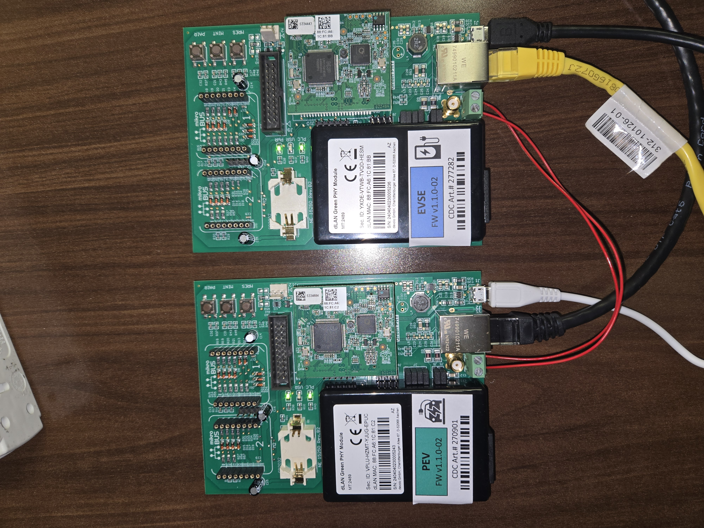
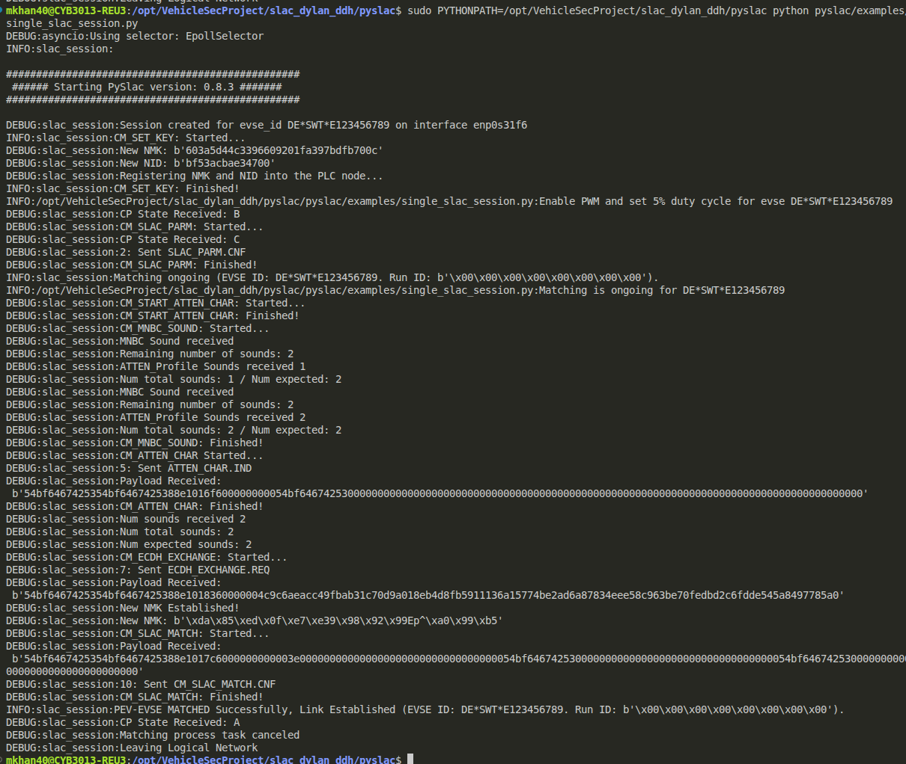
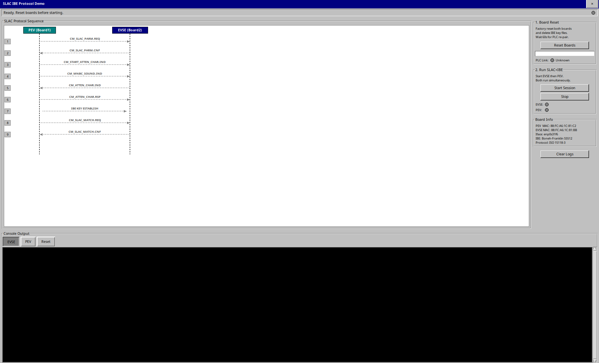
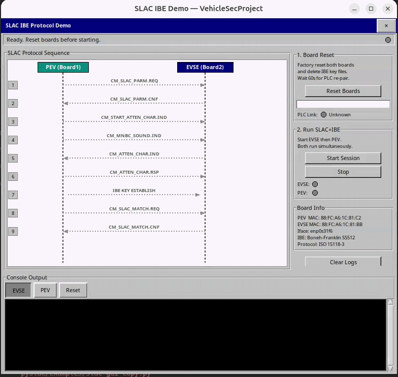
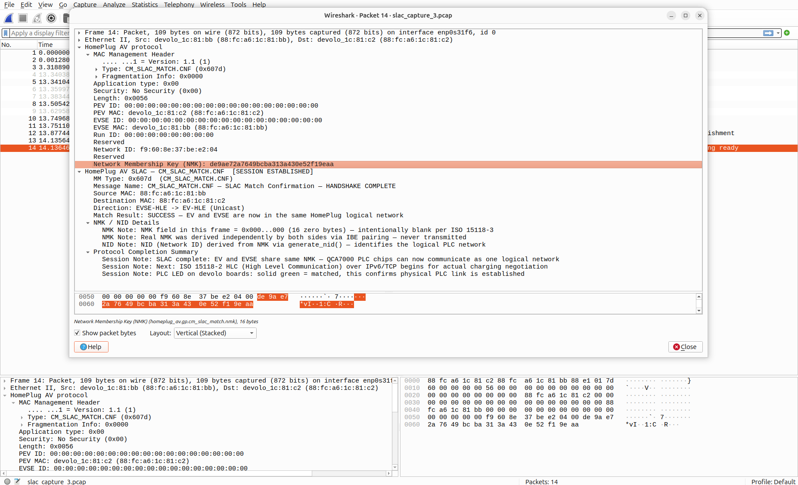

# IBE-SLAC: Non-Interactive Identity-Based Key Establishment for ISO 15118-3 SLAC


This repository implements a non-interactive Identity-Based Cryptography (IBC) key establishment scheme integrated into the ISO 15118-3 SLAC protocol for EV charging security. It replaces the plaintext NMK transmission (standard SLAC) and the interactive ECDH exchange (Dylan's extension) with a zero-frame key establishment using bilinear pairings. Both EV and EVSE independently derive the same Network Membership Key (NMK) without transmitting any key material over the PLC wire.

This work is built on top of [dylanc1/pyslac (dh-based branch)](https://github.com/dylanc1/pyslac/tree/dh-based), which itself is a fork of [EcoG-io/pyslac](https://github.com/EcoG-io/pyslac).

---

## Table of Contents

1. [Background](#background)
2. [New Integration](#New-Integration)
3. [Hardware Requirements](#hardware-requirements)
4. [Physical Connection](#physical-connection)
5. [Host PC Network Configuration](#host-pc-network-configuration)
6. [Software Installation](#software-installation)
7. [Configuration](#configuration)
8. [Running the Protocol](#running-the-protocol)
9. [Using the GUI](#using-the-gui)
10. [Wireshark Packet Capture](#wireshark-packet-capture)
11. [Expected Results](#expected-results)
12. [Troubleshooting](#troubleshooting)
13. [Repository Structure](#repository-structure)
14. [Protocol Comparison](#protocol-comparison)
15. [References](#references)

---

## Background

The SLAC (Signal Level Attenuation Characterization) protocol, defined in ISO 15118-3, establishes a logical PLC network between an electric vehicle (PEV) and its charging station (EVSE) before charging begins. The two sides must agree on a shared Network Membership Key (NMK), a 16-byte AES-128 key that encrypts all subsequent PLC traffic.

**Standard SLAC vulnerability:** The NMK is transmitted in plaintext inside `CM_SLAC_MATCH.CNF`. Any passive attacker with a PLC sniffer can capture this frame and decrypt all PLC communication.

**Dylan's ECDH extension:** Replaces plaintext NMK with an ECDH key exchange. Two additional frames (`CM_ECDH_EXCHANGE.REQ` and `CM_ECDH_EXCHANGE.RSP`) carry EC public keys. While the NMK is no longer transmitted in plaintext, the EC public keys are observable by any node on the PLC network, and the exchange is unauthenticated.

**This work (IBC):** Replaces the interactive ECDH exchange entirely. Both PEV and EVSE independently compute the same NMK using bilinear pairings and identity strings derived from MAC addresses. No additional frames are sent. The protocol frame count is identical to standard SLAC (8 frames). No cryptographic material appears in any transmitted frame.

---

## New Integration

Starting from Dylan's `dh-based` branch, the following changes were made:

- Removed the `CM_ECDH_EXCHANGE` interactive key exchange entirely
- Added `pyslac/ibe_key_establishment.py`: Boneh-Franklin IBE over the SS512 pairing group using Charm-Crypto
- Modified `pyslac/session.py`: added `cm_ibe_key_establishment()` method called after `cm_atten_char()` and before `cm_slac_match()`
- Modified `pyslac/examples/ev_slac_scapy.py`: added `ibeKeyEstablishment()` function on the PEV side
- Added `slac_gui.py`: a tkinter-based GUI for running the full demo workflow
- Added `homeplug_slac.lua`: a Wireshark Lua dissector for annotated frame decoding

The NMK field in `CM_SLAC_MATCH.CNF` is set to a random 16-byte value. The IBE-derived NMK is computed locally on both sides and never transmitted.

---

## Hardware Requirements

You need exactly two devolo dLAN Green PHY Eval Board II devices and a Linux host PC.

| Component | Details |
|---|---|
| PEV Board (Board 1) | devolo dLAN Green PHY Eval Board II |
| EVSE Board (Board 2) | devolo dLAN Green PHY Eval Board II |
| PLC Modem | Qualcomm QCA7000 (on both boards) |
| Microcontroller | NXP LPC1758 ARM Cortex-M3 (on both boards) |
| Firmware version | FW v1.1.0-02 on both boards |
| Host OS | Ubuntu 24, Linux 6.x kernel |
| Host Python | 3.7 or higher (tested on 3.14) |
| Root access | Required — SLAC uses raw Layer 2 sockets |

The boards in the reference setup have the following addresses. You will need to replace these with your own board MAC addresses throughout the configuration.

| Role | MAC Address | IP Address |
|---|---|---|
| PEV (Board 1) | 88:FC:A6:1C:81:C2 | 192.168.0.11 |
| EVSE (Board 2) | 88:FC:A6:1C:81:BB | 192.168.0.12 |

---

## Physical Connection

### Figure: Hardware Setup



*Two devolo dLAN Green PHY Eval Board II devices. PEV board on the left, EVSE board on the right. Twisted-pair PLC cable connected between J3 screw terminals on both boards.*

### Power

Both boards are powered via Micro-USB cables connected to USB ports on the host PC. No external power supply is required.

### Ethernet

**Board 1 (PEV):** Connect the RJ45/J2 Ethernet port directly to the host PC's built-in Ethernet interface (`enp0s31f6` in the reference setup).

**Board 2 (EVSE):** The EVSE board is reachable through the PLC link established over the J3 twisted-pair wire. It does not need a separate Ethernet connection to the host. But we have given PC to board2, second Ethernet interface (`enxa0cec837bab6` in the reference setup. a USB-C 
Ethernet dongle). The host runs the EVSE Python process over this interface using raw Layer 2 sockets to communicate with the EVSE board's QCA7000 chip.


### PLC Wire (J3 Screw Terminals)

Connect the two boards using two copper wires screwed into the J3 screw terminal blocks on each board:

```
Board 1 J3 Pin 1 (PLC+) ---- wire ---- Board 2 J3 Pin 1 (PLC+)
Board 1 J3 Pin 2 (PLC-)  ---- wire ---- Board 2 J3 Pin 2 (PLC-)
```

Use a small flathead screwdriver to open and tighten the terminal screws. Any thin copper wire works.

### Initial Board Pairing

After connecting the J3 wire:

1. Press the PAIR button on Board 1 (PEV)
2. Within 60 seconds press the PAIR button on Board 2 (EVSE)
3. The PLC LED on both boards will go solid green when pairing succeeds

Verify the PLC link speed after pairing:

```bash
sudo plctool -i enp0s31f6 -m 88:FC:A6:1C:81:C2
```

Expected output includes `AvgPHYDR_TX = 009 mbps`.

---

## Host PC Network Configuration

The reference host PC has two network interfaces:

| Interface | Connection |
|---|---|
| `enp0s31f6` | Built-in Ethernet, connected directly to Board 1 (PEV) |
| `enxa0cec837bab6` | USB-C Ethernet dongle, connected directly to Board 2 (EVSE) |

Your interface name will differ. Find it with `ip link` and use it wherever `enp0s31f6` appears in commands and configuration files.

Verify both boards are reachable:

```bash
ping 192.168.0.11   # PEV board
ping 192.168.0.12   # EVSE board
```

Query board hardware directly using plctool:

```bash
sudo plctool -i enp0s31f6 -I 88:FC:A6:1C:81:C2
sudo plctool -i enxa0cec837bab6 -I 88:FC:A6:1C:81:BB
```

---

## Software Installation

### Step 1: Install PBC Library (required for Charm-Crypto)

Charm-Crypto needs the PBC (Pairing-Based Cryptography) library built from source.

```bash
sudo apt install libgmp-dev flex bison
wget https://crypto.stanford.edu/pbc/files/pbc-0.5.14.tar.gz
tar xzf pbc-0.5.14.tar.gz
cd pbc-0.5.14
./configure
make
sudo make install
sudo ldconfig
```

### Step 2: Install Charm-Crypto

```bash
git clone https://github.com/JHUISI/charm.git
cd charm
pip install .
```

If that fails, try:

```bash
pip install charm-crypto
```

### Step 3: Clone this repository

```bash
git clone https://github.com/jahanxb/noninteractive-ibc-slac.git
cd noninteractive-ibc-slac
```

### Step 4: Set up a virtual environment

```bash
python3 -m venv venv
source venv/bin/activate
pip install scapy
```

### Step 5: Fix marshmallow version conflict (Python 3.14)

```bash
sudo pip install "marshmallow>=3.0.0,<4.0.0" "environs==9.5.0" --break-system-packages
```

### Step 6: Install the pyslac package

```bash
sudo pip install -e . --break-system-packages --ignore-installed cryptography
```

### Step 7: Verify installation

```bash
sudo python -c "import pyslac; print(pyslac.__file__)"
```

Expected output:

```
/path/to/ibe-slac/pyslac/__init__.py
```

---

## Configuration

### Network Interface and Board MAC Addresses

Open `pyslac/examples/cs_configuration.json` and set your interface name:

```json
{
  "number_of_evses": 1,
  "parameters": [
    {
      "evse_id": "DE*SWT*E123456789",
      "network_interface": "ADD_NETWORK_INTERFACE"
    }
  ]
}
```

Open `pyslac/examples/ev_slac_scapy.py` and set your board MAC addresses and interface:

```python
PEV_MAC  = "XX:XX:XX:XX:XX:XX"   # MAC address of your PEV board
EVSE_MAC = "XX:XX:XX:XX:XX:XX"   # MAC address of your EVSE board
IFACE    = "enp0s31f6"            # Your Ethernet interface name
```

Open `pyslac/session.py` and set the EVSE board MAC:

```python
host_mac = "XX:XX:XX:XX:XX:XX"   # MAC address of your EVSE board
```

Open `slac_gui.py` and update these constants at the top:

```python
IFACE      = "enp0s31f6"            # Your interface name
BOARD_PEV  = "XX:XX:XX:XX:XX:XX"   # PEV board MAC
BOARD_EVSE = "XX:XX:XX:XX:XX:XX"   # EVSE board MAC
```

### Environment Settings

Create or edit `.env` in the project root:

```
SLAC_INIT_TIMEOUT=10000
LOG_LEVEL=DEBUG
```

---

## Running the Protocol

**The board reset in Step 1 is mandatory before every session.** The EVSE runs `evse_set_key()` at startup which reprograms the QCA7000 with a new random NMK. If the boards were previously paired with a different NMK, the PLC link will break and SLAC frames will not be received. Always reset and re-pair before each run.

### Step 1: Reset Both Boards and Delete IBE Key Files

```bash
# Factory reset both boards
sudo plctool -i enxa0cec837bab6 -T XX:XX:XX:XX:XX:XX   # EVSE MAC
sudo plctool -i enp0s31f6 -T XX:XX:XX:XX:XX:XX   # PEV MAC

# Delete IBE key files — forces fresh key generation each run
rm -f ibe_master_secret.bin ibe_generator.bin

# Wait 60 seconds for boards to auto-pair, then verify link
sudo plctool -i enp0s31f6 -m XX:XX:XX:XX:XX:XX   # PEV MAC
# Expected: AvgPHYDR_TX = 009 mbps
```

### Step 2: Start EVSE (Terminal 1)

```bash
cd /path/to/ibe-slac
sudo venv/bin/python pyslac/examples/single_slac_session.py
```

Wait until the terminal prints:

```
CP State B : EVSE waiting for CM_SLAC_PARM.REQ...
```

The EVSE takes approximately 12 seconds to initialize. Do not start the EV until this line appears.

### Step 3: Start EV (Terminal 2)

```bash
sudo venv/bin/python pyslac/examples/ev_slac_scapy.py
```

The full handshake runs automatically. Both terminals will display the IBE key establishment details and the derived NMK. Verify that the NMK printed on both sides is identical.

The terminal output samples are given in folder output_samples/single_slac_session.txt and slac_scapy.txt


---

## Using the GUI

The GUI automates the full workflow and provides an animated sequence diagram showing each SLAC step as it executes.

```bash
sudo python slac_gui.py
```

**Panel 1 — Board Reset:** Click "Reset Boards". The GUI factory resets both QCA7000 boards, deletes IBE key files, waits 60 seconds for boards to auto-pair, then verifies the PLC link speed. A progress bar shows the countdown.

**Panel 2 — Run SLAC+IBE:** Click "Start Session". The GUI starts the EVSE process, waits 15 seconds for chip initialization, then starts the EV process. The sequence diagram on the left animates each protocol step as it is logged. The IBE step shows a highlighted box labelled "IBE — NO WIRE TRAFFIC" between the attenuation and match steps.

**Console tabs:** Three tabs (EVSE, PEV, Reset) show the full output from each process in real time.

### Figure: GUI Demo







---

## Wireshark Packet Capture
#### Not mandatory but for better packet exploration, you can use this plugin. 
### Install the Custom Lua Dissector

```bash
sudo cp homeplug_slac.lua /usr/lib/x86_64-linux-gnu/wireshark/plugins/
```

Reload plugins in Wireshark with `Ctrl+Shift+L`.

### Capture Filter

To capture only HomePlug AV SLAC frames:

```
eth.type == 0x88e1
```

### Capture to File

```bash
sudo tshark -i enp0s31f6 -f "ether proto 0x88e1" -w capture.pcap
```

The dissector labels each frame with its SLAC step, direction, and a description of what it carries. For `CM_SLAC_MATCH.CNF` it shows the NMK field with a note explaining that the real NMK is never transmitted.

### Figure: Wireshark Capture



*Wireshark capture of a complete IBE-SLAC session. 8 frames total. CM_SLAC_MATCH.CNF frame shows NMK field confirming no key material was transmitted over the wire.*


---

## Expected Results

### Terminal Output

After a successful run you should see the following on both terminals. The NMK values must be identical.

**EVSE terminal:**

```
CM_SET_KEY: Finished!
[STEP 1]  SLAC PARAMETER EXCHANGE + IDENTITY DISCOVERY
  EV   ID : EV:88fca61c81c2
  EVSE ID : EVSE:88fca61c81bb

[STEP 5]  IBE KEY ESTABLISHMENT  (EVSE Side)
  NMK     : 578e4650bedb6d9e0164b6abc55d89de  (16 bytes)
  NID     : 44adefa9e2d30e  (7 bytes)

[STEP 6]  SLAC MATCH - HANDSHAKE COMPLETE
  Result  : PEV-EVSE MATCHED

PEV-EVSE MATCHED Successfully, Link Established
```

**EV terminal:**

```
[STEP 6]  IBE KEY ESTABLISHMENT  (PEV Side)
  NMK     : 578e4650bedb6d9e0164b6abc55d89de  (16 bytes)
  NID     : 44adefa9e2d30e  (7 bytes)

SLAC + IBE HANDSHAKE COMPLETE
  NMK Match : Both EV and EVSE derived same NMK independently

PEV-EVSE MATCHED Successfully!
```

### Protocol Frame Count

| Protocol | Total Frames | Extra Key Frames | Key Material on Wire |
|---|---|---|---|
| Original SLAC (ISO 15118-3) | 8 | 0 — NMK in plaintext | NMK plaintext |
| SLAC + ECDH (Dylan 2025) | 10 | +2 frames | EC public keys visible |
| SLAC + IBC (this work) | 8 | 0 | None |

---

## Troubleshooting

**`ModuleNotFoundError: No module named 'pyslac'`**

Run with the virtual environment Python explicitly:
```bash
sudo venv/bin/python pyslac/examples/single_slac_session.py
```

**`ModuleNotFoundError: No module named 'charm'`**

Charm-Crypto is not installed in the environment being used by sudo. Install it system-wide:
```bash
sudo pip install charm-crypto --break-system-packages
```

**`AttributeError: module 'marshmallow' has no attribute '__version_info__'`**

Downgrade marshmallow to a 3.x version:
```bash
sudo pip install "marshmallow>=3.0.0,<4.0.0" --break-system-packages --force-reinstall
```

**`OSError: There is no such interface`**

The interface name in `cs_configuration.json` or `ev_slac_scapy.py` does not match your system. Run `ip link` to find the correct name.

**EVSE times out waiting for `CM_SLAC_PARM.REQ`**

The EV was started before the EVSE finished chip initialization. The EVSE needs approximately 12 seconds after printing `CM_SET_KEY: Finished!` before it is ready. Wait for the `EVSE waiting for CM_SLAC_PARM.REQ` message before starting the EV.

**`Timeout waiting for CM_SLAC_PARM.CNF`**

The boards lost their PLC pairing because `evse_set_key()` programmed a new random NMK into the chip. Perform the full board reset procedure (Step 1) and wait for the 60-second settle period before running again.

**PLC LED goes off during session**

This is expected. `evse_set_key()` resets the NMK on the QCA7000 chip at the start of each session, which drops the PLC pairing. The LED will go solid again after the SLAC match completes. To restore the pairing after running, press the PAIR button on both boards.

**`error: uninstall-no-record-file for cryptography`**

```bash
sudo pip install -e . --break-system-packages --ignore-installed cryptography
```

**NMK values differ between EV and EVSE**

The IBE key files (`ibe_master_secret.bin`, `ibe_generator.bin`) were not deleted before the run. One side loaded a stale master secret. Delete the files and run again:
```bash
rm -f ibe_master_secret.bin ibe_generator.bin
```

---

## Repository Structure

```
ibe-slac/
    pyslac/
        examples/
            single_slac_session.py      EVSE side entry point
            ev_slac_scapy.py            EV simulator with IBC
            cs_configuration.json       Interface and EVSE ID config
        session.py                      EVSE SLAC session with IBC integration
        ibe_key_establishment.py        Boneh-Franklin IBE over SS512
        environment.py                  Environment variable handling
        enums.py                        SLAC message type definitions
        sockets/
            async_linux_socket.py       Raw socket implementation
    slac_gui.py                         Demo GUI
    homeplug_slac.lua                   Wireshark Lua dissector
    Figures/
        Hardware_setup.jpg              Hardware photo
        SLAC_protocol.png               Protocol sequence diagram
        SLAC_MATCH.png                  Wireshark capture screenshot
        gui_demo.png                    GUI screenshot
        session_demo.gif                Full session demo GIF
    .env                                Environment settings
    requirements.txt                    Python dependencies
    README.md                           This file
```

---

## Protocol Comparison

The full SLAC + IBC frame sequence:

| Step | Frame | Direction | Description |
|---|---|---|---|
| 1 | CM_SLAC_PARM.REQ | PEV → Broadcast | EV announces presence. EVSE learns PEV MAC, becomes IBE identity. |
| 2 | CM_SLAC_PARM.CNF | EVSE → PEV | EVSE confirms. PEV learns EVSE MAC, becomes IBE identity. |
| 3 | CM_START_ATTEN_CHAR.IND | PEV → Broadcast | EV initiates attenuation measurement. |
| 4 | CM_MNBC_SOUND.IND | PEV → Broadcast | Sound bursts for PLC attenuation measurement. |
| 5 | CM_ATTEN_CHAR.IND | EVSE → PEV | EVSE sends averaged attenuation profile. |
| 6 | CM_ATTEN_CHAR.RSP | PEV → EVSE | EV acknowledges. Both sides begin IBC locally. |
| 7 | IBC Key Establishment | LOCAL | Both sides compute bilinear pairing independently. Zero frames sent. |
| 8 | CM_SLAC_MATCH.REQ | PEV → EVSE | EV requests final SLAC matching. |
| 9 | CM_SLAC_MATCH.CNF | EVSE → PEV | EVSE confirms. Session established. |

---

## References

- ISO 15118-3: Vehicle to Grid Communication Interface — Physical and Data Link Layer Requirements
- Boneh, D. and Franklin, M., Identity-Based Encryption from the Weil Pairing, CRYPTO 2001
- Baker, R. and Martinovic, I., Losing the Car Keys: Wireless PHY-Layer Insecurity in EV Charging, USENIX Security 2019
- EcoG-io/pyslac: https://github.com/EcoG-io/pyslac
- dylanc1/pyslac dh-based branch: https://github.com/dylanc1/pyslac/tree/dh-based
- Charm-Crypto: https://github.com/JHUISI/charm
- Qualcomm open-plc-utils (plctool): https://github.com/qca/open-plc-utils
- HomePlug Green PHY Specification Release Version 1.1
- devolo dLAN Green PHY Eval Board II Data Sheet v1.00